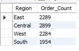
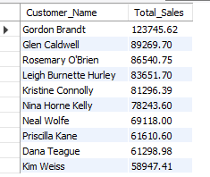

# Project: RFM Segmentation and Super Store Sales Data Analysis using MySQL

📌 **Project Overview**

This project focuses on **RFM (Recency, Frequency, Monetary)** segmentation for Super Store sales data analysis using **MySQL**. The goal is to analyze customer purchasing behavior, identify high-value customers, and generate insightful business reports to enhance growth strategies.
## 📊Features & Analysis Included

- Sales Data Storage & Cleaning

- Exploratory Data Analysis (EDA)

- RFM Segmentation for Customer Analysis

- Business Performance Reports & Insights

- Growth-Oriented Analytical Queries

## 🚀 Getting Started

1️⃣ Prerequisites

- Ensure you have the following installed:

- MySQL Server (v8.0+ recommended)

- MySQL Workbench (optional, for easy query execution)

- Sample Sales Dataset (CSV format for import)
## 2️⃣ Database Setup

**1. Create the Database**

```sql
  CREATE DATABASE IF NOT EXISTS Superstore_Sales;
  USE Superstore_Sales;
```

**2. Create the Superstore_Sales Table**
```sql
  CREATE TABLE Superstore_Sales (
    Row_ID INT PRIMARY KEY,
    Order_Priority VARCHAR(50),
    Discount DECIMAL(5,2),
    Unit_Price DECIMAL(10,2),
    Shipping_Cost DECIMAL(10,2),
    Customer_ID INT,
    Customer_Name VARCHAR(100),
    Ship_Mode VARCHAR(50),
    Customer_Segment VARCHAR(50),
    Product_Category VARCHAR(50),
    Product_Sub_Category VARCHAR(50),
    Product_Container VARCHAR(50),
    Product_Name VARCHAR(255),
    Product_Base_Margin DECIMAL(5,2),
    Region VARCHAR(50),
    Manager VARCHAR(50),
    State_or_Province VARCHAR(50),
    City VARCHAR(50),
    Postal_Code INT,
    Order_Date DATE,
    Ship_Date DATE,
    Profit DECIMAL(15,2),
    Quantity_Ordered INT,
    Sales DECIMAL(15,2),
    Order_ID INT,
    Return_Status VARCHAR(50)
);
```

**3. INSERT THE ATTACH DATA THERE (PREFERABLY BULK INSERTION**

Load the sales data from a CSV file into the Superstore_Sales table. Ensure the file path is correct and accessible by the MySQL server.

```sql
  LOAD DATA INFILE 'C:/ProgramData/MySQL/MySQL Server 8.0/Uploads/Superstore Sales Data.csv'
  INTO TABLE Superstore_Sales
  FIELDS TERMINATED BY ',' 
  ENCLOSED BY '"'
  LINES TERMINATED BY '\n'
  IGNORE 1 ROWS
  (Row_ID, Order_Priority, Discount, Unit_Price, Shipping_Cost, Customer_ID, Customer_Name, Ship_Mode, Customer_Segment, Product_Category, Product_Sub_Category, Product_Container, Product_Name, @Product_Base_Margin, Region, Manager, State_or_Province, City, Postal_Code, @Order_Date, @Ship_Date, Profit, Quantity_Ordered, Sales, Order_ID, Return_Status)
  SET 
    Product_Base_Margin = IFNULL(NULLIF(@Product_Base_Margin, ''), 0),  -- Handle empty   values
    Order_Date = DATE_ADD('1899-12-30', INTERVAL @Order_Date DAY),  -- Convert Excel date
    Ship_Date = DATE_ADD('1899-12-30', INTERVAL @Ship_Date DAY);  -- Convert Excel date
```
Note: The DATE_ADD function adjusts Excel serial dates to MySQL DATE format.

**4. Loading the table: After the data is uploaded to the database system**

Statement: The query SELECT * FROM Superstore_Sales; retrieves all records and columns from the Superstore_Sales table, allowing for a comprehensive examination of the dataset's contents.

```sql
  SELECT * FROM Superstore_Sales;
```

**5. Find the minimum and maximum date**

```sql
  SELECT MAX(Order_Date) FROM Superstore_Sales;
  SELECT MIN(Order_Date) FROM Superstore_Sales;
```
Result:
```bash
  Get the most recent order date: 2013-12-31
  Get the earliest order date: 2010-01-01
```
**6. Data Cleaning**

After loading the data, ensure that date fields are correctly formatted.
```sql
  UPDATE Superstore_Sales
  SET order_date = STR_TO_DATE(order_date, '%Y-%m-%d');

  UPDATE Superstore_Sales 
  SET Ship_Date = STR_TO_DATE(Ship_Date, '%Y-%m-%d');
```

**7. Exploratory Data Analysis**
Exploratory Data Analysis (EDA) is a crucial step in understanding and summarizing the main characteristics of a dataset, often employing visual methods. In the context of the Superstore Sales dataset, EDA involves analyzing sales performance, customer demographics, and product categories to uncover patterns and insights that can drive business decisions.

1. Total Orders
To determine the total number of orders in the Superstore Sales dataset, the following SQL query can be used:
```sql
  SELECT COUNT(*) AS Total_Orders
  FROM Superstore_Sales;
```
**Result: 9426**

NOTE: This query counts all records in the _Superstore_Sales_ table, providing the total number of orders processed. Understanding the volume of orders is fundamental for assessing overall business activity and growth over time.

2. Product Categories
Identifying the distinct product categories offered by the store is essential for inventory management and marketing strategies. The following SQL query retrieves all unique product categories:
```sql
  SELECT DISTINCT Product_Category
  FROM Superstore_Sales;
```
**Result:**
- **Office Supplies**
- **Technology**
- **Furniture**

NOTE: This query extracts unique values from the _Product_Category_ column, allowing the business to understand its product range and focus on categories that perform well.

3. Orders by Region
Analyzing order distribution across different regions helps in identifying high-performing areas and regions that may need targeted marketing efforts. The SQL query below groups orders by region:
```sql
  SELECT Region, COUNT(*) AS Order_Count
  FROM Superstore_Sales
  GROUP BY Region;
```
**Result:**




NOTE:This query counts the number of orders in each region, providing insights into regional sales performance. Such information is valuable for regional sales strategies and resource allocation.

4. Top 10 Customers by Sales

Recognizing the top customers contributes to personalized marketing and customer retention strategies. The following query lists the top 10 customers based on total sales:
```sql
  SELECT Customer_Name, SUM(Sales) AS Total_Sales
  FROM Superstore_Sales
  GROUP BY Customer_Name
  ORDER BY Total_Sales DESC
  LIMIT 10;
```

**Result:**




## RFM Segmentation

**📖 What is RFM?**

RFM (Recency, Frequency, Monetary) segmentation is a method to classify customers based on their purchasing behavior:

- **Recency (R):** Days since the last purchase

- **Frequency (F):** Number of purchases

- **Monetary (M):** Total amount spent

### 🛠️ RFM Score Calculation

**1. RFM Segmentation**

```sql
  CREATE OR REPLACE VIEW RFM_SCORE_DATA AS

  WITH CUSTOMER_AGGREGATED_DATA AS (
    SELECT 
        Customer_Name,
        DATEDIFF((SELECT MAX(Order_Date) FROM Superstore_Sales), MAX(Order_Date)) AS  Recency_Value,
        COUNT(DISTINCT Order_ID) AS Frequency_Value,
        ROUND(SUM(Sales),0) AS Monetary_Value
    FROM Superstore_Sales
    GROUP BY Customer_Name
  ),
  RFM_SCORE AS (
    SELECT 
        C.*,
        NTILE(4) OVER (ORDER BY Recency_Value DESC) AS R_Score,
        NTILE(4) OVER (ORDER BY Frequency_Value ASC) AS F_Score,
        NTILE(4) OVER (ORDER BY Monetary_Value ASC) AS M_Score
    FROM CUSTOMER_AGGREGATED_DATA AS C
  )
  SELECT
    R.Customer_Name,
    R.Recency_Value,
    R_Score,
    R.Frequency_Value,
    F_Score,
    R.Monetary_Value,
    M_Score,
    (R_Score + F_Score + M_Score) AS Total_RFM_Score,
    CONCAT_WS('', R_Score, F_Score, M_Score) AS RFM_Score_Combination
  FROM RFM_SCORE AS R;
```
NOTE: First, run the full code. This time, it will not display any output because it creates a table in the view section. This table does not save as an extra table; it fully depends on the main table, which is Superstore_Sales, so it does not take up extra space. Now, run this full SQL code again, but ignore the first line; start from the second line, which begins with "WITH CUSTOMER_AGGREGATED_DATA AS (".


**1. Define Customer Segments**

```sql
  CREATE OR REPLACE VIEW RFM_ANALYSIS AS
  SELECT 
    RFM_SCORE_DATA.*,
    CASE
        WHEN RFM_Score_Combination IN ('111', '112', '121', '132', '211', '212', '114', '141') THEN 'CHURNED CUSTOMER'
        WHEN RFM_Score_Combination IN ('133', '134', '143', '224', '334', '343', '344', '144') THEN 'SLIPPING AWAY, CANNOT LOSE'
        WHEN RFM_Score_Combination IN ('311', '411', '331') THEN 'NEW CUSTOMERS'
        WHEN RFM_Score_Combination IN ('222', '231', '221', '223', '233', '322') THEN 'POTENTIAL CHURNERS'
        WHEN RFM_Score_Combination IN ('323', '333', '321', '341', '422', '332', '432') THEN 'ACTIVE'
        WHEN RFM_Score_Combination IN ('433', '434', '443', '444') THEN 'LOYAL'
        ELSE 'Other'
     END AS Customer_Segment
  FROM RFM_SCORE_DATA;
```
NOTE: First, run the full code. This time, it will not display any output because it creates a table in the view section. This table does not save as an extra table; it fully depends on the main table, which is Superstore_Sales, so it does not take up extra space. Now, run this full SQL code again, but ignore the first line; start from the second line, which begins with 'WITH CUSTOMER_AGGREGATED_DATA AS ('.

### 📌 Customer Segment Analysis

```sql
  SELECT 
    Customer_Segment,
    COUNT(*) AS Number_of_Customers,
    ROUND(AVG(Monetary_Value), 0) AS Average_Monetary_Value
  FROM RFM_ANALYSIS
  GROUP BY Customer_Segment
  ORDER BY Number_of_Customers DESC;

```
## 📈 Conclusion

This project provides powerful insights into customer behavior and business performance using MySQL-based RFM segmentation. It helps businesses optimize marketing strategies, improve customer retention, and increase profitability.

## 🔥 Key Takeaways:

✅ Understand Customer Buying Patterns 📊

✅ Identify High-Value Customers 🏆

✅ Improve Sales Strategies 🚀

✅ Analyze Business Growth Trends 📈
